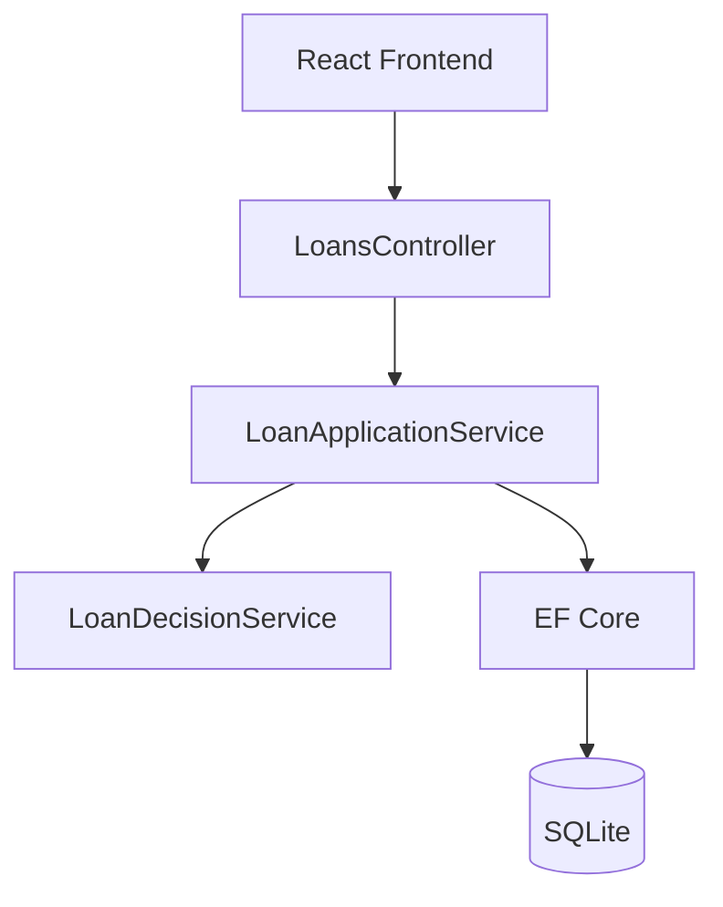
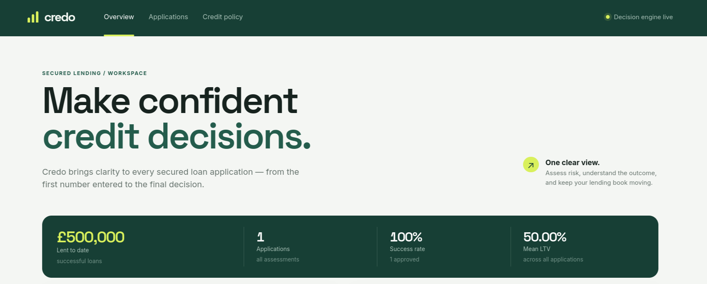
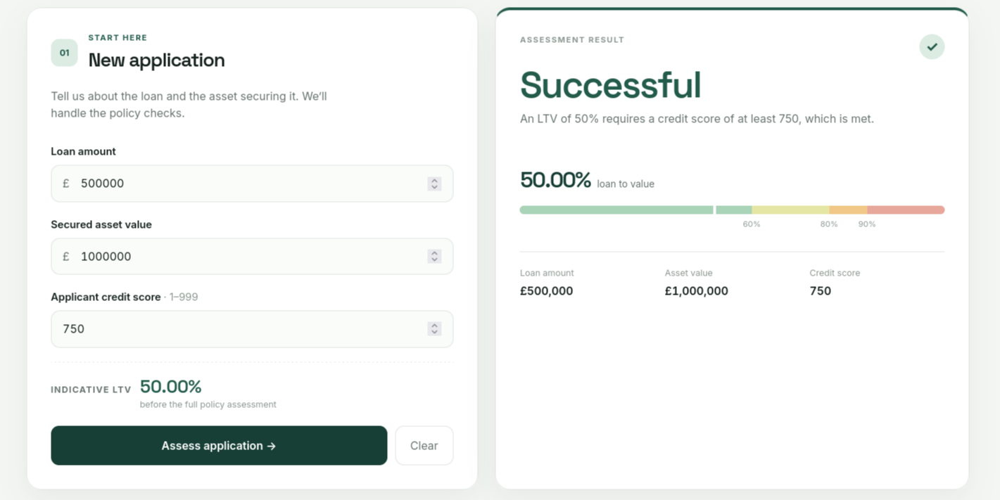
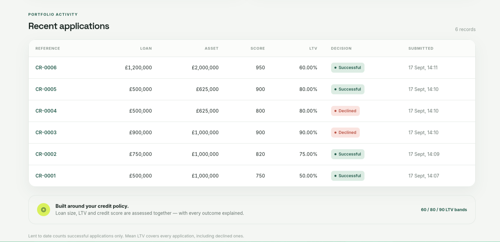

<h1 align="center">
    
</h1>

<p align="center">
  <i>A secured lending decision platform</i>
</p>

<p align="center">
  
  
  
  
  
  
  
  
  
</p>

## Introduction

Credo is a full-stack lending platform that scores secured loan applications against a credit policy and reports on the book written to date.

An application is assessed on three inputs — the loan amount, the value of the asset securing it, and the applicant's credit score. The platform calculates the loan to value ratio, applies the lending rules, returns a decision with the reason behind it, and persists the application so it can be reported on.

Built with an ASP.NET Core Web API and a React frontend, the system focuses on keeping the lending rules isolated, explicit and independently testable.

### Core Features

- Instant loan decisioning against a documented credit policy
- Loan to value calculation with exact decimal arithmetic
- Reasoned outcomes — every decision explains which rule produced it
- Portfolio statistics: applicant counts, total lent, mean LTV
- Full application history
- Layered validation, with the backend authoritative
- RESTful API documented with Swagger
- xUnit test suite covering every rule boundary

---

## Architecture Overview

Credo follows a layered client-server architecture:

- **Frontend:** React (Vite)
- **Backend:** ASP.NET Core Web API (.NET 10)
- **Database:** SQLite via Entity Framework Core
- **Documentation:** Swagger / OpenAPI
- **Testing:** xUnit

Request flow:



`LoanDecisionService` is a pure class with no dependency on HTTP, EF Core or I/O. No lending rule lives in the controller or the frontend, and entities never cross the API boundary — everything is mapped to DTOs.

---

# Application Screenshots

## Header

<p align="center">
  
</p>

<p align="center">
  Landing view with the portfolio position — total lent, applicant counts and mean LTV — visible at a glance.
</p>

---

## Assessment

<p align="center">
  
</p>

<p align="center">
  Application form with a live LTV preview, and the decision alongside it showing the outcome, the reason, and where the application sits against the 60 / 80 / 90% thresholds.
</p>

---

## Recent Records

<p align="center">
  
</p>

<p align="center">
  Full application history — reference, amounts, credit score, LTV, decision and submission time — newest first.
</p>

---

## Business Rules

`LTV = (Loan Amount / Asset Value) × 100`

### General limits
- Decline if the loan is below **£100,000**
- Decline if the loan is above **£1,500,000**

### Loans of £1,000,000 or more
- LTV must be **60% or less**
- Credit score must be **950 or above**

### Loans below £1,000,000

| LTV band | Minimum credit score |
| --- | --- |
| Under 60% | 750 |
| Under 80% | 800 |
| Under 90% | 900 |
| 90% and above | Declined outright |

---

## Edge Cases Handled

Every row below is covered by the xUnit suite and can be reproduced through Swagger.

| Loan | Asset | Score | LTV | Expected | Why it matters |
| --- | --- | --- | --- | --- | --- |
| £99,999.99 | £500,000 | 999 | 20% | Declined | One penny under the £100,000 floor |
| £100,000 | £500,000 | 750 | 20% | Successful | The floor is inclusive |
| £1,500,000 | £2,500,000 | 950 | 60% | Successful | The ceiling is inclusive |
| £1,500,000.01 | £5,000,000 | 999 | 30% | Declined | One penny over the ceiling |
| £1,000,000 | £1,250,000 | 999 | 80% | Declined | £1m exactly is a large loan, so LTV must be ≤ 60% |
| £999,999.99 | £1,250,000 | 800 | 80% | Successful | One penny under £1m switches to the ladder |
| £1,200,000 | £2,000,000 | 949 | 60% | Declined | Large loan, one point below the 950 threshold |
| £1,200,000 | £2,000,000 | 950 | 60% | Successful | 950 is inclusive |
| £600,000 | £1,000,000 | 799 | 60% | Declined | 60% is not "under 60%", so 800 is required |
| £600,000 | £1,000,000 | 800 | 60% | Successful | Band boundary read literally |
| £800,000 | £1,000,000 | 899 | 80% | Declined | 80% falls into the "under 90%" band, needing 900 |
| £800,000 | £1,000,000 | 900 | 80% | Successful | Band boundary read literally |
| £900,000 | £1,000,000 | 999 | 90% | Declined | 90% and above is declined at any score |
| £899,999 | £1,000,000 | 900 | 90.00% shown | **Successful** | True LTV is 89.9999% — the decision uses the unrounded value, so rounding for display never changes the outcome |

### Invalid input

These return **400 Bad Request** with a field-level message, not a decline. An application whose LTV cannot be calculated was never underwritten, and recording it as declined would corrupt both the decline count and the mean LTV.

| Input | Result |
| --- | --- |
| Asset value = 0 | 400 — LTV cannot be calculated |
| Asset value negative | 400 |
| Loan amount negative or zero | 400 |
| Credit score 0 or 1000 | 400 — must be between 1 and 999 |

---

## API

| Method | Endpoint | Purpose |
| --- | --- | --- |
| `POST` | `/api/loans` | Submit an application, receive a decision, store the result |
| `GET` | `/api/loans` | Application history, newest first |
| `GET` | `/api/loans/statistics` | Applicant counts, total lent, mean LTV |

Example request:

```bash
curl -X POST http://localhost:5199/api/loans \
  -H "Content-Type: application/json" \
  -d '{"loanAmount":750000,"assetValue":1000000,"creditScore":820}'
```

Interactive documentation is available at `http://localhost:5199/swagger`.

---

## Assumptions

These were the ambiguous points in the specification. Each is a defensible reading, and each can be changed in one place.

1. **Mean LTV covers all applications, including declined ones** — the requirement says "across all applications".
2. **Total value of loans written counts successful applications only** — a decline results in no money being lent.
3. **Band boundaries are read literally.** "60% or less" makes exactly 60% acceptable for large loans, while "if LTV < 60%" excludes exactly 60% from that band on the ladder. £100,000 and £1,500,000 are both accepted; £1,000,000 exactly is a large loan.
4. **Decisions use the unrounded LTV.** Stored and displayed values are rounded to 2dp, but comparisons use full decimal precision.
5. **Credit score is a whole number from 1 to 999.** Anything outside is a validation error, not a decline.
6. **One application is one applicant**, as no applicant entity exists in the inputs.

---

# Environment variables

`.env` file example at `/frontend/.env` — optional, only needed if the API is not on its default port.

```text
VITE_API_BASE_URL=http://localhost:5199
```

The API connection string lives in `backend/LendingPlatform.Api/appsettings.json` and defaults to a local SQLite file:

```text
"ConnectionStrings": { "LendingDatabase": "Data Source=lending.db" }
```

# Setup

Requires the **.NET 10 SDK** and **Node.js 18+**.

1. Clone the repository

```bash
git clone https://github.com/<your-username>/credo.git
cd credo
```

2. Install dependencies

```bash
cd frontend/ && npm install
```

The backend restores its NuGet packages automatically on first run.

3. Run the tests

```bash
cd backend/ && dotnet test
```

4. Run the project

```bash
cd backend/LendingPlatform.Api/ && dotnet run
cd frontend/ && npm run dev
```

The API starts on `http://localhost:5199` and creates `lending.db` on first run. The frontend starts on `http://localhost:5173`.

---

## Testing

```bash
cd backend
dotnet test
```

The suite covers the loan amount floor and ceiling, the £1,000,000 threshold, every LTV band boundary, the credit score thresholds at 750 / 800 / 900 / 950, invalid input, the rounding edge case, and the statistics calculations. The rules and the aggregations are tested directly as plain classes — no database or HTTP host required.

---

## Production Considerations

- **Database migrations.** The project uses `EnsureCreated()` so a reviewer can run it immediately; production would use EF Core migrations applied at deploy time.
- **Statistics aggregation.** SQLite has no native decimal type, so aggregation happens in memory with exact decimal arithmetic. At real volume this becomes a maintained aggregate or a database with proper `NUMERIC` support.
- **Policy as configuration.** Credit policy changes without a redeploy. Thresholds would move out of code, and each application would store the policy version that judged it, for audit.
- **Reason codes.** Decisions currently return English strings; production would return a code with presentation-layer lookup.
- **Authentication, rate limiting and an audit trail** of who submitted what — out of scope here, essential in production.

## P.S 
- This project was created with help of Claude AI, ChatGPT and Creativity ✨
